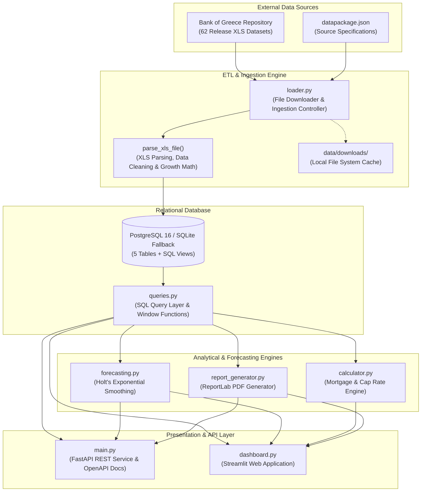
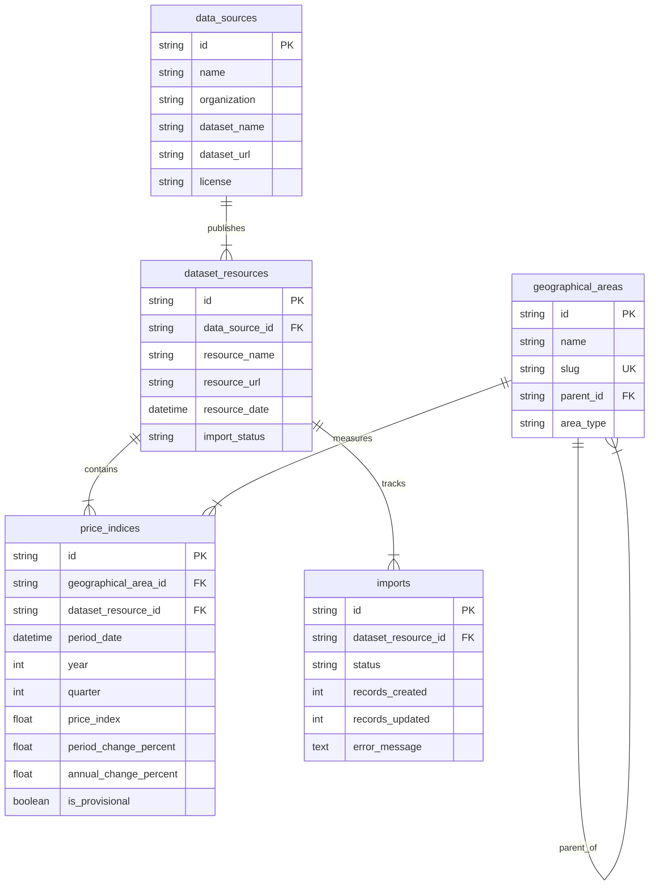

# Greek Real Estate Market Analytics Platform

An end-to-end, production-grade financial analytics platform and REST API for parsing, storing, analyzing, and forecasting official **Bank of Greece** apartment price index datasets. The system features an automated ETL pipeline, normalized relational database architecture, machine learning time-series forecasting, real estate investment ROI calculators, dynamic executive PDF generation, and a bilingual interactive web application.

---

## 🚀 Live Demo

🔗 **Public Deployed Application:** [https://greek-real-estate-analytics.onrender.com](https://greek-real-estate-analytics.onrender.com)

---

## 📊 Project Overview

The **Greek Real Estate Market Analytics Platform** normalizes and analyzes 20+ years of official quarterly apartment price indices published by the Bank of Greece (Base Year 2021 = 100). It transforms raw macroeconomic release files into actionable financial intelligence for real estate investors, portfolio managers, financial analysts, and policy researchers.

### Key Outputs & Capabilities
* **Interactive Financial Dashboard:** Multi-page Streamlit analytics suite with interactive Plotly visualizations, custom time horizons, and bilingual localization (English 🇬🇧 & Greek 🇬🇷).
* **Machine Learning Time-Series Forecasting:** Holt's Linear Exponential Smoothing engine projecting price index levels 1 to 3 years into the future with 95% confidence intervals.
* **Investor ROI & Loan Calculator:** Financial calculator for evaluating Net Cap Rate, Gross Yield, ENFIA property tax friction, monthly mortgage payments (PMT), Cash-on-Cash Return, and full annual amortization schedules.
* **Automated Executive PDF Reports:** ReportLab engine generating downloadable executive summaries with dynamic macroeconomic findings and regional tables.
* **Production REST API:** High-performance FastAPI backend delivering endpoints for time-series data, market summary statistics, ML forecasts, CSV exports, and dynamic PDF generation.

---

## 🏗️ Architecture



---

## 🔄 Data Pipeline

The data ingestion engine operates through a structured pipeline:

1. **Metadata Synchronization (`datapackage.json`):** Reads dataset resource specifications, URLs, licenses, and release dates, synchronizing source records into the `data_sources` entity.
2. **Resource Fetching & Ingestion (`loader.py`):** Downloads official XLS files published by the Bank of Greece into local storage (`downloads/` or `data/downloads/`).
3. **Data Cleaning & Growth Rate Recalculation (`parse_xls_file`):** Parses raw XLS cells using `xlrd`, sanitizing string floats and missing value markers (`:`, `-`, blank). Observations are sorted chronologically to recalculate exact Quarter-over-Quarter (QoQ %) and Year-over-Year (YoY %) growth rates directly from index levels, preserving provisional status indicators (`is_provisional`).
4. **Database Ingestion (`models.py`):** Inserts clean observations into PostgreSQL/SQLite database tables via SQLAlchemy sessions. Uses composite unique constraints (`uq_area_date`) to update existing records when new data releases supersede older revisions.
5. **Audit Logging (`imports`):** Records ingestion events, start/completion timestamps, created records, updated records, and error tracebacks in the `imports` table.
6. **Analytics Serving:** Exposes cleaned data and derived window metrics to FastAPI endpoints and Streamlit dashboard components.

---

## 🗄️ Database

The database architecture is designed with 5 normalized relational entities and 1 optimized SQL view using SQLAlchemy 2.0 ORM.

### Entity Relationship Model



### Table Definitions & Primary Keys

| Table | Primary Key | Foreign Keys | Key Columns / Constraints |
|---|---|---|---|
| `data_sources` | `id` (UUID) | None | `dataset_name`, `license`, `organization` |
| `dataset_resources` | `id` (String) | `data_source_id` | `resource_name`, `resource_date`, `import_status` |
| `geographical_areas` | `id` (UUID) | `parent_id` | `slug` (Unique), `name`, `area_type` |
| `price_indices` | `id` (UUID) | `geographical_area_id`, `dataset_resource_id` | `period_date`, `price_index`, `period_change_percent`, `annual_change_percent`, `is_provisional`, `uq_area_date` (Unique Constraint) |
| `imports` | `id` (UUID) | `dataset_resource_id` | `status`, `records_created`, `records_updated`, `error_message` |

### Database Views & Indexes
* **`latest_price_indices` SQL View:** Implements `DISTINCT ON (geographical_area_id, period_date)` ordered by `resource_date DESC` to guarantee queries always retrieve authoritative index levels from the most recent dataset release.
* **Indexes:** Performance indexes on `price_indices` over `(geographical_area_id)`, `(period_date)`, `(year)`, and `(dataset_resource_id)`.

---

## 📡 Data Sources

| Source Name | Dataset / API | Provided Data | Official URL |
|---|---|---|---|
| **Bank of Greece** (*Τράπεζα της Ελλάδος*) | Real Estate Market Analysis Section — Apartment Price Index | 79 quarterly index observations (2006 Q1 to 2025 Q3), Base 2021=100, YoY/QoQ growth rates, provisional status markers | [opendata.bankofgreece.gr](https://opendata.bankofgreece.gr/en/dataset/5) |

*All 62 historical release files contained in `datapackage.json` are downloaded and indexed into the pipeline.*

---

## 📈 Analytics

The analytics engine (`queries.py`, `forecasting.py`, `calculator.py`) provides quantitative analysis across multiple dimensions:

* **Macroeconomic Cycle Tracking:** Automated identification of historical market peaks, recession troughs, and post-recession recovery trajectories.
* **Growth Rate Metrics:** Exact computation of Quarter-over-Quarter (QoQ %) short-term momentum and Year-over-Year (YoY %) annual growth rates.
* **Annualized Aggregations:** Derivation of yearly average index levels and year-over-year growth rates based on annual index averages.
* **Time-Series Forecasting:** Holt's Linear Exponential Smoothing projecting index levels up to 12 quarters (3 years) ahead with expanding 95% confidence bounds.
* **Real Estate Financial Engineering:** Investor ROI calculations including Gross Rental Yield, Net Cap Rate after property tax (ENFIA) and maintenance costs, monthly mortgage payment (PMT), and Cash-on-Cash Return.

---

## 🧮 Key Metrics & Calculations

The platform implements the following financial and statistical calculations:

### 1. Quarter-over-Quarter (QoQ) Growth Rate %
$$\text{QoQ}_t = \left( \frac{\text{Index}_t - \text{Index}_{t-1}}{\text{Index}_{t-1}} \right) \times 100$$

### 2. Year-over-Year (YoY) Growth Rate %
$$\text{YoY}_t = \left( \frac{\text{Index}_t - \text{Index}_{t-4}}{\text{Index}_{t-4}} \right) \times 100$$

### 3. Yearly Average YoY Growth Rate %
$$\text{Annual YoY}_y = \left( \frac{\bar{I}_y - \bar{I}_{y-1}}{\bar{I}_{y-1}} \right) \times 100, \quad \text{where } \bar{I}_y = \frac{1}{4} \sum_{q=1}^{4} \text{Index}_{y,q}$$

### 4. Peak-to-Trough Recession Decline %
$$\text{Recession Decline} = \left( \frac{\text{Index}_{\text{trough}} - \text{Index}_{\text{peak}}}{\text{Index}_{\text{peak}}} \right) \times 100$$

### 5. Trough-to-Latest Recovery Rebound %
$$\text{Recovery Rebound} = \left( \frac{\text{Index}_{\text{latest}} - \text{Index}_{\text{trough}}}{\text{Index}_{\text{trough}}} \right) \times 100$$

### 6. Gross Rental Yield %
$$\text{Gross Yield} = \left( \frac{\text{Monthly Rent} \times 12}{\text{Property Price}} \right) \times 100$$

### 7. Net Cap Rate %
$$\text{Net Cap Rate} = \left( \frac{(\text{Monthly Rent} \times 12) - (\text{Annual ENFIA} + \text{Annual Maintenance})}{\text{Property Price}} \right) \times 100$$

### 8. Monthly Mortgage Payment (PMT)
$$\text{PMT} = P \times \frac{r(1+r)^n}{(1+r)^n - 1}$$
*where $P = \text{Loan Amount}$, $r = \frac{\text{Annual Interest Rate}}{12}$, $n = \text{Loan Years} \times 12$.*

### 9. Holt's Linear Exponential Smoothing Forecast & 95% CI Bounds
$$\hat{y}_{t+h} = \ell_t + h b_t \pm \left( 1.96 \times \sigma_{\text{resid}} \times \sqrt{h} \right)$$
*where $\ell_t$ is level, $b_t$ is trend, $h$ is forecast step horizon, and $\sigma_{\text{resid}}$ is model residual standard error.*

---

## 📊 Dashboard

The Streamlit dashboard (`dashboard.py`) features 8 dedicated analytics views:

1. **📊 Dashboard Overview:** Summary KPI cards (Latest Index, QoQ %, YoY %, Cumulative Change), primary Plotly time-series trend chart, market record cards, and CSV export.
2. **💡 Market Insights:** Automated macroeconomic cycle breakdown detailing peak-to-trough recession drops and trough-to-latest recovery gains.
3. **⚖️ Compare Areas:** Multi-region performance comparison and normalized baseline index tracking (Base Period = 100).
4. **🔮 ML Price Forecast:** Interactive time-series projection controls (1 to 20 quarters) powered by Holt's Exponential Smoothing with 95% confidence intervals.
5. **🗺️ Greece Regional Map:** Interactive Plotly geographic map visualizing regional valuations.
6. **🧮 ROI & Loan Calculator:** Real estate investment metrics calculator (Gross Yield, Net Cap Rate, ENFIA tax, Cash-on-Cash Return) with interactive annual loan amortization schedules.
7. **🔍 Data Explorer:** Visual query engine filtering by valuation bounds, provisional status, and custom quarter ranges.
8. **🛡️ Data Sources & Provenance:** Dataset metadata breakdown, inventory of 62 imported XLS files, and audit logs.

### Application Preview

```
+-----------------------------------------------------------------------------------+
| 🏛️ GREEK REAL ESTATE MARKET ANALYTICS PLATFORM                                    |
| Bank of Greece Open Data (Base 2021=100)                                          |
+------------------+----------------------------------------------------------------+
|  NAVIGATION      |  [ Latest Index: 114.01 ] [ QoQ: +1.33% ] [ YoY: +6.55% ]     |
|  ----------------|----------------------------------------------------------------+
|  📊 Dashboard    |  📈 APARTMENT PRICE INDEX TRAJECTORY (2006 Q1 - 2025 Q3)       |
|  💡 Insights     |  120 |                                                .-'      |
|  ⚖️ Compare      |  100 | -- Peak (101.43) --..                         /         |
|  🔮 ML Forecast  |   80 |                        \                       /          |
|  🗺️ Map          |   60 |                         `-- Trough (56.10) --'           |
|  🧮 Calculator   |      +-------------------------------------------------------  |
|  🔍 Explorer     |       2006   2008   2010   2013   2017   2020   2023   2025     |
|  🛡️ Provenance   |----------------------------------------------------------------+
|                  |  📄 EXECUTIVE REPORT DOWNLOAD [PDF] | 📥 EXPORT DATA [CSV]     |
+------------------+----------------------------------------------------------------+
```

---

## ✅ Data Quality & Validation

The codebase includes robust data quality controls to ensure numerical precision and mathematical consistency:

* **Unique Constraint Enforcement:** Database schema enforces `uq_area_date` (`geographical_area_id` + `period_date`), preventing duplicate entries per quarter.
* **Strict Numerical Parsing:** `parse_number()` safely handles non-numeric strings (`:`, `-`, empty cells), converting valid entries to double-precision floats.
* **Chronological Recalculation:** Ingestion pipeline sorts raw observations chronologically to calculate exact QoQ and YoY growth percentages directly from index values rather than relying on unverified text cells.
* **Synthetic Region Prevention:** Verified by `test_no_synthetic_regions` unit test to guarantee that zero fabricated regional scaling multipliers exist in the pipeline.
* **Annual Average Growth Accuracy:** Verified by `test_yearly_granularity_growth` unit test to ensure yearly YoY growth rates derive from annual average index levels.
* **Referential Integrity:** Foreign keys configured with `ondelete="CASCADE"` maintain strict data consistency across datasets, resources, area entities, and indices.

---

## 🧪 Testing

The repository contains a pytest test suite verifying API routes, financial calculations, forecasting models, database queries, and numerical integrity.

### Test Inventory (17 Passed Tests)

* **`tests/test_api.py` (5 tests):** FastAPI service endpoints (`/`, `/health`, `/api/areas`, `/api/price-indices`, `/api/metrics/summary`).
* **`tests/test_calculator.py` (1 test):** Financial ROI, Net Cap Rate, ENFIA tax, and amortization schedule logic.
* **`tests/test_forecasting.py` (1 test):** Holt's exponential smoothing forecast generation, horizon length, and confidence interval bounds.
* **`tests/test_loader.py` (1 test):** XLS number parsing and missing string handling.
* **`tests/test_models.py` (1 test):** SQLAlchemy ORM database queries and model relationships.
* **`tests/test_numerical_truth.py` (7 tests):** Strict audit tests verifying zero synthetic regions, zero duplicate observations, exact quarter count (79 quarters), QoQ formula accuracy, YoY formula accuracy, yearly average growth math, and dynamic market insights.
* **`tests/test_report.py` (1 test):** ReportLab PDF document compilation and byte output validation.

### Running Unit Tests

Activate the virtual environment and execute pytest:

```bash
# Run full unit test suite
venv/bin/pytest

# Run pytest with code coverage breakdown
venv/bin/pytest --cov=. --cov-report=term-missing
```

---

## ⚙️ Tech Stack

| Category | Technologies |
|---|---|
| **Language** | Python 3.10+ |
| **Database** | PostgreSQL 16, SQLite (Zero-config Fallback), SQLAlchemy 2.0 ORM, Alembic |
| **Data Processing** | Pandas, NumPy, Statsmodels, xlrd, OpenPyXL |
| **REST API** | FastAPI, Uvicorn, Pydantic v2, HTTPX |
| **Web Dashboard** | Streamlit 1.40+, Plotly Express / Graph Objects |
| **PDF Generation** | ReportLab |
| **Configuration** | python-dotenv |
| **Containerization** | Docker, Docker Compose |
| **Testing & Profiling** | Pytest, Pytest-Cov |

---

## 💻 Installation

### 1. Local Run

**Prerequisites:**
* Python 3.10 or higher
* PostgreSQL database instance (or SQLite fallback)

**Steps:**

1. **Clone Repository:**
   ```bash
   git clone https://github.com/tsakirisand/Greek-Real-Estate-Analytics-.git
   cd Greek-Real-Estate-Analytics-
   ```

2. **Create & Activate Virtual Environment:**
   ```bash
   python3 -m venv venv
   source venv/bin/activate  # On Windows: venv\Scripts\activate
   ```

3. **Install Dependencies:**
   ```bash
   pip install -r requirements.txt
   ```

4. **Configure Environment Variables (`.env`):**
   Copy `.env.example` to `.env`:
   ```bash
   cp .env.example .env
   ```
   *If `DATABASE_URL` is omitted, the application automatically uses a local SQLite database (`data/app.db`).*

5. **Initialize Database Schema & Run Ingestion:**
   ```bash
   # Initialize tables and latest_price_indices SQL view
   python3 create_tables.py

   # Run Python ETL pipeline to load Bank of Greece dataset resources
   python3 loader.py
   ```

6. **Launch Applications:**
   ```bash
   # Launch Streamlit Financial Dashboard
   streamlit run dashboard.py --server.port 8501

   # Launch FastAPI REST API
   uvicorn main:app --host 0.0.0.0 --port 8000 --reload
   ```

   * **Dashboard Access:** `http://localhost:8501`
   * **API Documentation:** `http://localhost:8000/docs`

### 2. Run with Docker Compose

```bash
docker-compose up --build
```

* **Streamlit Dashboard:** `http://localhost:8501`
* **FastAPI Service:** `http://localhost:8000` (Swagger UI: `http://localhost:8000/docs`)

---

## ▶️ Usage

### Interacting with the Application

1. **Streamlit Web Dashboard:** Open `http://localhost:8501` in your browser. Use the sidebar controls to switch language (English / Greek), select time horizons, toggle granularities, adjust forecast horizons, calculate loan terms, or download PDF executive reports.
2. **REST API Endpoints:** Explore interactive OpenAPI documentation at `http://localhost:8000/docs`:
   * `GET /api/areas`: Retrieve geographical regions.
   * `GET /api/price-indices`: Query price indices filtered by date range and area.
   * `GET /api/metrics/summary`: Fetch summary KPIs (latest index, QoQ %, YoY %).
   * `GET /api/forecast?areaId=athens&quarters=12`: Fetch Holt's ML time-series forecast.
   * `GET /api/export/pdf`: Download formatted executive PDF report.
   * `GET /api/export`: Download dataset in CSV format.
3. **Manual Ingestion Sync:** Trigger the ETL pipeline manually via API `POST /api/import` or shell:
   ```bash
   python3 loader.py
   ```

---

## 📁 Project Structure

```
GreekRealEstateAnalytics/
├── .streamlit/
│   └── config.toml           # Streamlit dark theme & UI configuration
├── alembic/
│   ├── env.py                # Alembic database migration environment
│   └── versions/             # Migration version scripts
├── data/
│   └── datapackage.json      # Bank of Greece dataset source metadata & resource URLs
├── tests/
│   ├── test_api.py           # FastAPI endpoint tests
│   ├── test_calculator.py    # Financial ROI & loan calculator tests
│   ├── test_forecasting.py   # Time-series ML forecast tests
│   ├── test_loader.py        # ETL XLS parsing unit tests
│   ├── test_models.py        # SQLAlchemy database model tests
│   ├── test_numerical_truth.py # Stringent numerical accuracy & audit tests
│   └── test_report.py        # ReportLab PDF report generation tests
├── .env.example              # Template environment variable configuration
├── .gitignore                # Git exclusion rules
├── alembic.ini               # Alembic configuration file
├── api_client.py             # Python client utility for API consumption
├── create_tables.py          # Database table & SQL view initializer script
├── dashboard.py              # Streamlit interactive analytics web application
├── database.py               # SQLAlchemy database engine and session configuration
├── docker-compose.yml        # Docker Compose service orchestration
├── Dockerfile                # Docker build configuration
├── forecasting.py            # Holt's Linear Exponential Smoothing ML model
├── i18n.py                   # Bilingual localization module (EN / EL)
├── loader.py                 # Ingestion pipeline controller & XLS parser
├── logger.py                 # Logging configuration module
├── main.py                   # FastAPI REST service entrypoint
├── models.py                 # SQLAlchemy ORM models (5 entities)
├── profiler.py               # Query performance benchmarking utility
├── pyproject.toml            # Project build & pytest metadata
├── pytest.ini                # Pytest configuration settings
├── queries.py                # Database query layer & dynamic insights engine
├── README.md                 # Project documentation
├── report_generator.py       # ReportLab executive PDF report generator
├── requirements.txt          # Production Python dependencies
└── schemas.py                # Pydantic request/response schemas
```

---

## 🔍 Reproducibility

To reproduce the analytics dataset and database state from scratch:

1. Delete existing SQLite database file if present (`data/app.db`).
2. Run database initialization:
   ```bash
   python3 create_tables.py
   ```
3. Execute the ETL loader script to fetch official Bank of Greece datasets:
   ```bash
   python3 loader.py
   ```
4. Verify database state with pytest:
   ```bash
   venv/bin/pytest tests/test_numerical_truth.py
   ```

---

## 📌 Key Findings

All data points are extracted directly from official Bank of Greece index series (Athens area):

1. **Great Recession Market Collapse (-44.69%):** From the pre-crisis peak of **101.43** in **2008 Q2**, apartment price indices in Athens suffered a cumulative drop of **-44.69%**, bottoming at a trough level of **56.10** in **2017 Q1**.
2. **Post-2017 Market Doubling (+103.23%):** Following the 2017 Q1 trough (56.10), apartment indices staged a sustained recovery, rebounding **+103.23%** to reach **114.01** by **2025 Q3**.
3. **2021 Baseline Surpass (+14.01%):** As of **2025 Q3**, the price index level stands **+14.01%** above the 2021 base year benchmark (=100).
4. **Historical Expansion Record (+17.39% YoY):** The highest recorded annual growth rate occurred in **2023 Q1** (**+17.39% YoY**), whereas the maximum single-year drop occurred in **2013 Q2** (**-13.16% YoY**).
5. **Latest Market Velocity (2025 Q3):** The latest quarter (**2025 Q3**) recorded an index level of **114.01**, representing a **+1.33% QoQ** gain and a **+6.55% YoY** increase.

---

## 🔮 Future Improvements

1. **Expanded Regional Granularity:** Ingest prefecture and municipal-level sub-indices as separate release files become available on the Bank of Greece portal.
2. **Automated Scraping Pipeline:** Implement Apache Airflow or Celery DAGs to automatically poll and extract new quarterly XLS releases from the Bank of Greece.
3. **Ensemble ML Forecasting Models:** Expand the time-series forecasting suite by combining Holt's Exponential Smoothing with Prophet and XGBoost models.
4. **Geospatial Interactive Layer:** Integrate Mapbox / Folium polygon maps for interactive neighborhood-level valuation overlays across Greek municipalities.
5. **Cloud-Native Serverless Deployment:** Deploy the FastAPI REST service to AWS ECS Fargate or Lambda with Amazon Aurora Serverless PostgreSQL.

---

## 👨‍💻 Author

**Andreas Tsakiris**

* **GitHub:** [https://github.com/tsakirisand](https://github.com/tsakirisand)
